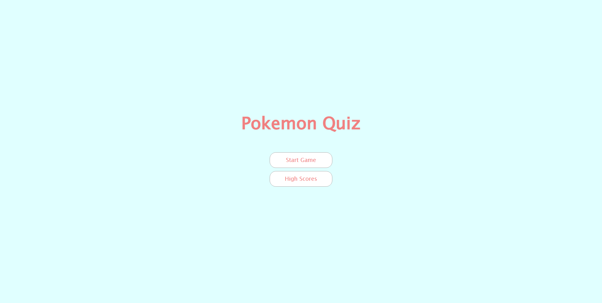

# <Your-Project-Title>

## Description

Just a little pokemon quiz that helped me learn more about HTML, CSS and especially JavaScript since I was a bit more weak in it than HTML and CSS. Going through the refrence 
really helped me understand JavaScript a bit more.

## Usage

Use buttons to navigate to quiz or high score.

Link to my deployed page: https://hajiru.github.io/quick-quiz-hw/

## Credits

<a href = "https://www.youtube.com/playlist?list=PLDlWc9AfQBfZIkdVaOQXi1tizJeNJipEx">James Q Quick</a>

## License

Refer to the LICENSE in the repository.

## Features

Has an high score feature that you can access by simply going through the quiz, inputting a username and saving.
Then you are able to view all past high scores by visiting the home page and clicking "High Scores".
